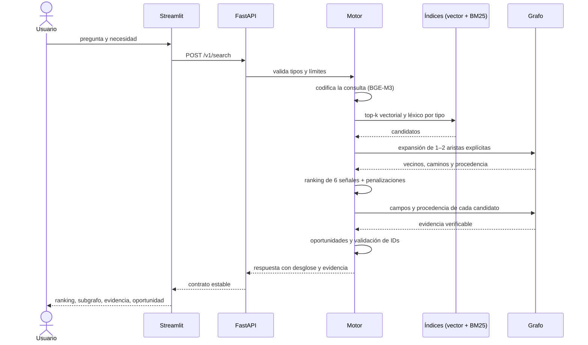

# Arquitectura implementada

> Este documento describe **lo que existe y se ejecuta**, no un diseño ideal.
> Cada caja del diagrama corresponde a módulos reales del repositorio, citados
> con su ruta. El diseño original está en
> [`ARQUITECTURA_SOLUCION_HIBRIDA_ORIGINAL.md`](ARQUITECTURA_SOLUCION_HIBRIDA_ORIGINAL.md);
> las diferencias con lo construido se listan al final.

## 1. Vista general

```mermaid
flowchart LR
    subgraph F["1 · Fuentes"]
        csv["Data V1.0<br/>CSV y Markdown<br/><i>data/</i>"]
    end
    subgraph P["2 · Procesamiento"]
        val["Validación y<br/>normalización<br/><i>knowledge_nexus_data</i>"]
        sem["Documentos<br/>semánticos<br/>3.292"]
        emb["Embeddings<br/>BGE-M3 1024d<br/><i>embeddings/pipeline.py</i>"]
    end
    subgraph R["3 · Representación"]
        graph["Grafo<br/>3.327 nodos<br/>6.353 aristas"]
        vect["Índice vectorial<br/>en memoria"]
        lex["Índice léxico<br/>BM25"]
    end
    subgraph D["4 · Descubrimiento"]
        query["Contexto de<br/>consulta"]
        hybrid["Recuperación híbrida<br/>vectorial + léxica<br/>+ expansión de grafo"]
    end
    subgraph V["5 · Valoración"]
        rank["Ranking de 6 señales<br/>+ penalizaciones"]
        evid["Ensamblado de<br/>evidencia"]
        opp["Generador de<br/>oportunidades"]
    end
    subgraph S["6 · Resultados"]
        api["API FastAPI<br/><i>/v1/search</i>"]
        ui["Interfaz Streamlit<br/><i>ui/app.py</i>"]
    end

    csv --> val --> sem --> emb
    val --> graph
    emb --> vect
    sem --> lex
    query --> hybrid
    vect --> hybrid
    lex --> hybrid
    graph --> hybrid
    hybrid --> rank --> evid --> opp
    graph --> evid
    opp --> api --> ui
    rank --> api
```

## 2. Etapa por etapa

### 1 · Fuentes — `data/KNOWLEDGE_NEXUS_LATAM_DATA_V1_RC2_PARTICIPANTS/`

Los 22 CSV y los Markdown de Data V1.0. **Nunca se escriben.** Todo lo demás es
una capa derivada y reproducible.

### 2 · Procesamiento — `src/knowledge_nexus_data/`, `src/knowledge_nexus_retrieval/embeddings/`

| Paso | Módulo | Salida |
|---|---|---|
| Validar columnas, tipos e IDs | `validator.py` | `data_quality_report.json` |
| Construir entidades y relaciones | `graph_builder.py` | `graph_nodes.jsonl`, `graph_edges.jsonl` |
| Documento semántico por entidad | `semantic.py` | `semantic_documents.jsonl` (3.292) |
| Embeddings por lotes | `embeddings/pipeline.py` | `semantic_embeddings.jsonl` + manifiesto |

El texto semántico conserva el rol de cada campo (`Problema:`, `Metodología:`),
lo que permite el camino inverso: de un fragmento al campo exacto que lo originó
(`text.py::parse_labeled_sections`).

La indexación es **offline**: ninguna consulta de usuario calcula embeddings del
dataset. Solo se codifica la pregunta.

### 3 · Representación — `src/knowledge_nexus_retrieval/data/`, `retrieval/`

| Estructura | Módulo | Contenido |
|---|---|---|
| Grafo | `data/jsonl_graph.py` o Neo4j Aura | 3.327 nodos, 6.353 aristas explícitas con procedencia |
| Índice vectorial | `embeddings/store.py`, `retrieval/vector.py` | matriz normalizada 3.292 × 1024, filtrable por tipo |
| Índice léxico | `retrieval/lexical.py` | BM25 con unigramas y bigramas |

El grafo se consume siempre por el mismo contrato de cuatro métodos
(`data/graph_port.py`), así que cambiar de JSONL local a Aura es una variable de
entorno. Ninguna consulta Cypher vive fuera de la capa de datos.

### 4 · Descubrimiento — `src/knowledge_nexus_retrieval/retrieval/`

```
pregunta + necesidad
   → contexto de consulta (query.py): vector mezclado, términos, anclas institucionales
   → canal vectorial   (top-k por tipo)
   → canal léxico BM25 (top-k por tipo)
   → deduplicación por ID
   → expansión de 1–2 aristas explícitas desde las mejores semillas
   → conjunto de candidatos con la traza de por dónde entró cada uno
```

Los tres canales son complementarios: el vectorial cruza idiomas, el léxico ancla
términos verificables y la expansión trae personas, grupos y producción que
ningún texto menciona.

### 5 · Valoración — `ranking/`, `evidence/`, `opportunities/`

- **Ranking** (`ranking/features.py`, `scorer.py`): seis señales ponderadas menos
  penalizaciones, con el desglose completo visible. Detalle en
  [`RANKING.md`](RANKING.md).
- **Evidencia** (`evidence/assembler.py`): el paquete se cierra **antes** de
  redactar. Cada elemento lleva archivo, fila, campo y fragmento.
- **Oportunidades** (`opportunities/generator.py`): reglas deterministas sobre el
  respaldo recuperado; los IDs se validan contra el paquete (`IdentifierGuard`).
- **Confianza** (`engine.py::_confidence`): si la señal semántica del primer
  resultado es baja, la respuesta se marca como poco fiable en lugar de
  presentarse como un hallazgo.

### 6 · Resultados — `api/`, `ui/`

`POST /v1/search` devuelve conexiones, desglose, evidencia, subgrafo,
oportunidades, descartados y confianza. La interfaz Streamlit consume esa misma
respuesta y no conoce Neo4j ni credenciales.

## 3. Flujo de una consulta



## 4. El LLM no es fuente de evidencia

El adaptador (`llm/provider.py`) está implementado pero **desactivado por
defecto**: la redacción es por plantilla determinista. Si se conecta un
proveedor, solo puede reescribir un texto ya construido, y su salida se descarta
automáticamente si cita un ID que no esté en el paquete recuperado. Hay una
prueba que lo verifica.

Consecuencia práctica: el prototipo funciona sin Internet y sin ninguna API de
pago.

## 5. Diferencias con el diseño original

| Diseño original | Lo implementado | Motivo |
|---|---|---|
| Neo4j como único almacén de grafo y vectores | Grafo intercambiable (JSONL o Aura) e índice vectorial **en memoria** | Permite demostrar sin credenciales; el vector se carga en Aura cuando esté el índice |
| `neo4j-graphrag` para los retrievers | Recuperación propia sobre el contrato de 4 métodos | Menos dependencias y control total del desglose explicable |
| Reranker multilingüe opcional | No implementado | El ranking multiseñal ya discrimina; era explícitamente opcional |
| `POST /v1/feedback` y `/v1/admin/reindex` | No implementados | Fuera del alcance del MVP; la reindexación es un comando de CLI |
| `GET /v1/connections/{id}/evidence` | La evidencia viaja dentro de cada conexión | Evita un segundo viaje para la interfaz |
| Graphviz para el subgrafo | vis-network en la interfaz | Interactivo, sin dependencia de sistema |
| Docker Compose | Comandos reproducibles y entorno virtual | Un contenedor menos que falle en la demostración |

Endpoints añadidos que no estaban en el diseño: `GET /v1/needs`, para poblar el
selector de la interfaz.
