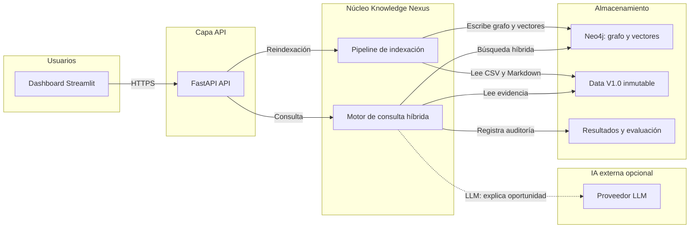
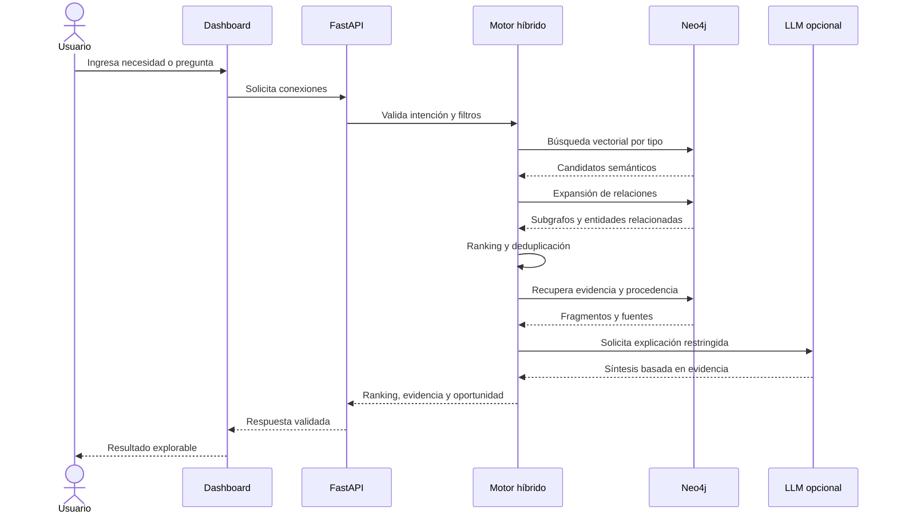

# Arquitectura de la solución híbrida Knowledge Nexus

## 1. Propósito

Este documento define una arquitectura implementable para la opción C: un sistema híbrido que combina un grafo de conocimiento con búsqueda vectorial para convertir datos institucionales dispersos en conexiones, recomendaciones y oportunidades de investigación explicables.

La arquitectura está pensada para un hackathon de aproximadamente 48 horas. Prioriza:

- funcionamiento de extremo a extremo;
- trazabilidad hacia Data V1.0;
- descubrimiento semántico más allá de palabras exactas;
- ranking interpretable;
- evidencia verificable;
- una ruta sencilla de evolución.

## 2. Resultado que debe producir

Ante una necesidad, consulta o entidad de entrada, el sistema debe devolver:

1. entidades relacionadas;
2. tipo de relación;
3. relevancia y desglose de la puntuación;
4. explicación de la conexión;
5. evidencia textual;
6. procedencia exacta;
7. oportunidad institucional propuesta, cuando corresponda.

Ejemplo de resultado:

```json
{
  "source": {
    "id": "NEED-001",
    "type": "institutional_need"
  },
  "target": {
    "id": "PRJ-002",
    "type": "project"
  },
  "relation": "relevant_antecedent",
  "relevance": {
    "total": 0.88,
    "semantic": 0.92,
    "domain": 0.90,
    "method": 0.75,
    "evidence": 0.95
  },
  "explanation": "El proyecto aborda riesgo académico y student attrition mediante analítica educativa.",
  "evidence": [
    {
      "file": "projects.csv",
      "record_id": "PRJ-002",
      "field": "problem_statement",
      "excerpt": "La información sobre riesgo académico..."
    }
  ],
  "opportunity": {
    "type": "RESEARCH_CONTINUITY",
    "title": "Sistema explicable de alerta temprana de riesgo académico"
  }
}
```

El score representa relevancia para la consulta, no verdad ni probabilidad científica.

## 3. Decisiones arquitectónicas

### 3.1 Monolito modular para el MVP

El backend se implementará como una sola aplicación desplegable, dividida internamente en módulos. No se usarán microservicios durante el hackathon.

Razones:

- menos configuración y menos puntos de fallo;
- depuración más rápida;
- demostración local reproducible;
- permite separar responsabilidades sin pagar el coste operativo de una arquitectura distribuida.

La evolución a servicios independientes será posible si aumentan el volumen, los usuarios o la frecuencia de indexación.

### 3.2 Neo4j como almacenamiento de grafo y vectores

Neo4j mantendrá:

- entidades institucionales;
- relaciones explícitas;
- relaciones inferidas aprobadas o calculadas;
- embeddings de los campos semánticos;
- propiedades de ranking y procedencia.

Usar un solo motor para el grafo y el índice vectorial evita sincronizar dos bases de datos durante el MVP. Si el volumen futuro lo exige, la búsqueda vectorial podrá migrarse a Qdrant, Milvus u otro motor especializado sin cambiar el contrato de la aplicación.

### 3.3 Datos originales inmutables

Los CSV y Markdown de Data V1.0 son la fuente de verdad y nunca se sobrescriben. Las normalizaciones, embeddings, índices y relaciones inferidas se consideran capas derivadas y reproducibles.

### 3.4 Separación entre indexación y consulta

El sistema posee dos flujos:

- **Indexación offline:** valida, normaliza, carga el grafo y calcula embeddings.
- **Consulta online:** recupera candidatos, expande relaciones, prioriza y explica.

Esto evita calcular embeddings de todo el dataset durante una consulta del usuario.

### 3.5 El LLM no es fuente de evidencia

El modelo de lenguaje solo puede:

- interpretar la intención de una consulta;
- sintetizar una explicación a partir de evidencia recuperada;
- redactar una oportunidad usando entidades existentes.

No puede inventar identificadores, capacidades, personas, proyectos ni fuentes. La respuesta se valida contra los IDs recuperados antes de entregarse.

### 3.6 Relaciones explícitas e inferidas separadas

Toda relación incluye `relation_origin`:

- `EXPLICIT`: proviene de un ID o tabla de relación de Data V1.0;
- `INFERRED`: fue calculada por similitud, reglas o ranking;
- `HUMAN_VALIDATED`: fue revisada por una persona.

Una relación inferida nunca se presenta visualmente como si fuera un hecho administrativo.

## 4. Arquitectura general

El diagrama editable se mantiene también en `docs/diagramas/arquitectura_general.mmd`.



## 5. Componentes y responsabilidades

### 5.1 Dashboard web

Responsabilidades:

- recibir una pregunta o seleccionar una necesidad;
- mostrar resultados ordenados;
- mostrar el desglose del score;
- visualizar el subgrafo de cada recomendación;
- abrir la evidencia y procedencia;
- permitir marcar una conexión como útil, dudosa o irrelevante.

Pantallas mínimas:

1. buscador y selector de necesidad;
2. ranking de conexiones;
3. detalle de evidencia;
4. oportunidad generada;
5. visualización del subgrafo;
6. panel simple de métricas.

### 5.2 API

Responsabilidades:

- validar solicitudes y respuestas;
- exponer el contrato funcional;
- coordinar el motor de consulta;
- aislar la interfaz de los detalles de Neo4j y del proveedor de IA.

Endpoints propuestos:

| Método | Ruta | Propósito |
|---|---|---|
| `POST` | `/v1/search` | Obtener conexiones priorizadas para texto o entidad |
| `POST` | `/v1/opportunities` | Generar oportunidades sustentadas |
| `GET` | `/v1/entities/{type}/{id}` | Consultar una entidad y sus relaciones |
| `GET` | `/v1/connections/{id}/evidence` | Auditar evidencia y procedencia |
| `POST` | `/v1/feedback` | Registrar validación humana |
| `POST` | `/v1/admin/reindex` | Reconstruir índices en modo administrativo |
| `GET` | `/health` | Verificar disponibilidad |

### 5.3 Pipeline de indexación

Etapas:

1. descubrir archivos mediante los catálogos y manifiestos;
2. validar columnas, tipos e IDs;
3. normalizar espacios, nulos, listas y texto, sin modificar los originales;
4. construir entidades canónicas;
5. cargar relaciones explícitas;
6. crear un documento semántico por entidad;
7. calcular embeddings;
8. cargar embeddings e índices vectoriales;
9. registrar versión del dataset, modelo y fecha;
10. ejecutar controles de integridad.

Ejemplo de documento semántico para un proyecto:

```text
Título: Modelo institucional para riesgo académico y student attrition.
Problema: ...
Objetivo: ...
Metodología: analítica educativa, integración de fuentes y validación.
Contexto: educación superior.
Resultados esperados: ...
```

No se debe concatenar todo sin etiquetas: conservar el rol de cada campo mejora la explicación posterior.

### 5.4 Grafo de conocimiento

#### Nodos principales

- `Faculty`
- `Program`
- `ResearchGroup`
- `ResearchLine`
- `Capability`
- `Researcher`
- `Expertise`
- `Subject`
- `Competency`
- `LearningOutcome`
- `InstitutionalNeed`
- `Project`
- `Thesis`
- `Publication`
- `Evidence`
- `Opportunity`

#### Relaciones explícitas

- `BELONGS_TO`
- `HAS_PROGRAM`
- `HAS_LINE`
- `MEMBER_OF`
- `PARTICIPATED_IN`
- `AUTHORED`
- `ADVISED`
- `RELATED_TO_PROJECT`
- `DEVELOPS_COMPETENCY`
- `HAS_OUTCOME`

#### Relaciones inferidas

- `RELEVANT_ANTECEDENT`
- `SEMANTICALLY_RELATED`
- `METHODOLOGICALLY_COMPATIBLE`
- `COMPLEMENTS`
- `CAN_SUPPORT`
- `CURRICULAR_ALIGNMENT`
- `POTENTIAL_COLLABORATOR`

Propiedades mínimas de una relación inferida:

```text
relation_origin
score_total
score_semantic
score_domain
score_method
score_graph
score_evidence
model_name
model_version
ranking_version
evidence_refs
created_at
validation_status
```

### 5.5 Búsqueda vectorial

Se generan embeddings para las entidades con contenido semántico: necesidades, proyectos, tesis, publicaciones, investigadores, grupos, líneas, capacidades, asignaturas, competencias y resultados de aprendizaje.

Cada tipo de entidad conserva un perfil textual diferente. El sistema puede filtrar por tipo antes o después de la búsqueda para evitar que una consulta devuelva una lista desordenada de entidades incomparables.

La búsqueda vectorial se utiliza para generar candidatos, no para producir la decisión final.

### 5.6 Recuperación híbrida

Flujo de recuperación:

1. interpretar la consulta y determinar entidades objetivo;
2. ejecutar búsqueda vectorial `top-k` por tipo relevante;
3. recuperar coincidencias léxicas como línea base;
4. expandir cada candidato uno o dos saltos en el grafo;
5. aplicar filtros de estado, dominio y disponibilidad;
6. deduplicar candidatos;
7. enviar candidatos al ranking explicable.

La expansión del grafo permite pasar de un proyecto recuperado semánticamente a sus investigadores, grupo, publicaciones y programa sin realizar nuevas inferencias textuales.

### 5.7 Ranking explicable

Fórmula inicial configurable:

```text
score_total =
  0.35 * similitud_semantica
  0.20 * compatibilidad_dominio
  0.15 * compatibilidad_metodologica
  0.10 * soporte_estructural_grafo
  0.10 * cobertura_evidencia
  0.10 * potencial_accionable
  - penalizaciones
```

Penalizaciones posibles:

- entidad inactiva;
- falta de evidencia;
- duplicidad o redundancia;
- dominio incompatible;
- relación basada en una única coincidencia superficial.

Los pesos son una hipótesis inicial. Deben almacenarse en configuración, versionarse y ajustarse con evaluación humana. La interfaz debe mostrar el desglose, no solo el total.

En una segunda iteración se puede agregar un reranker multilingüe sobre los mejores candidatos. No es requisito para el primer flujo funcional.

### 5.8 Ensamblador de evidencia

Antes de generar una explicación, este componente construye un paquete cerrado con:

- entidades participantes;
- campos relevantes;
- fragmentos exactos;
- archivo y registro de origen;
- caminos explícitos del grafo;
- scores y reglas aplicadas.

Si una afirmación no puede vincularse con este paquete, no se incluye en la respuesta.

### 5.9 Generador de oportunidades

Primero clasifica la oportunidad:

- `NEW_RESEARCH`
- `RESEARCH_CONTINUITY`
- `THESIS_TOPIC`
- `COLLABORATION`
- `CAPABILITY_ACTIVATION`
- `CURRICULAR_INTEGRATION`
- `KNOWLEDGE_TRANSFER`

Después completa una plantilla con evidencia. El LLM puede mejorar la redacción, pero la estructura y las entidades relacionadas provienen del sistema.

Reglas mínimas:

- una oportunidad debe responder a una necesidad o contexto identificable;
- debe tener al menos un antecedente o capacidad sustentada;
- no puede incluir IDs inexistentes;
- debe declarar incertidumbre cuando falte información;
- no debe presentarse como decisión académica aprobada.

## 6. Flujo de una consulta

El diagrama fuente está en `docs/diagramas/flujo_consulta.mmd`.



## 7. Ejemplo de extremo a extremo

Entrada:

```text
¿Qué nueva investigación puede ayudar a prevenir la deserción estudiantil?
```

### Recuperación semántica

El embedding encuentra:

- `PRJ-002`: riesgo académico y `student attrition`;
- `PRJ-003`: trayectorias educativas y acompañamiento temprano;
- `THS-002`: modelos longitudinales para riesgo académico;
- `THS-006`: clasificación supervisada y permanencia estudiantil.

### Expansión del grafo

Desde `PRJ-002` se recuperan:

- investigadores participantes;
- grupo de Analítica del Aprendizaje;
- programa asociado;
- publicaciones vinculadas.

También se buscan capacidades y currículo compatibles:

- capacidad de analítica y ciencia de datos aplicada a educación;
- asignatura de analítica educativa;
- asignatura de aprendizaje automático.

### Ranking

`PRJ-002` aparece primero por combinación de:

- equivalencia conceptual entre deserción y `student attrition`;
- dominio educativo;
- metodología aplicable;
- proyecto terminado con evidencia;
- investigadores identificables.

### Oportunidad

```text
Desarrollar y validar un sistema explicable de alerta temprana de riesgo académico,
combinando modelos longitudinales y clasificación supervisada, con participación
de especialistas en permanencia estudiantil y estudiantes de analítica educativa.
```

La interfaz presenta la oportunidad como hipótesis sustentada, no como aprobación institucional.

## 8. Herramientas propuestas

### Stack recomendado para el MVP

| Capa | Herramienta | Uso | Razón |
|---|---|---|---|
| Lenguaje | Python 3.12 | Backend, indexación y modelos | Unifica el trabajo de datos, IA y API |
| API | FastAPI + Pydantic | Contratos HTTP y validación | Rápido, tipado y documentación OpenAPI automática |
| Procesamiento | pandas | Lectura y normalización de CSV | Dataset manejable y curva de aprendizaje baja |
| Grafo y vectores | Neo4j 5.26 LTS o Aura | Entidades, relaciones e índice vectorial | Grafo y recuperación vectorial en un solo motor |
| Acceso a Neo4j | `neo4j` Python Driver | Consultas Cypher | Driver oficial |
| Recuperación | `neo4j-graphrag` | Índices y retrievers | Paquete oficial para patrones GraphRAG |
| Embeddings | BGE-M3 con Sentence Transformers | Texto español, inglés y documentos extensos | Modelo multilingüe y ejecutable localmente |
| Reranking opcional | BGE reranker multilingüe | Refinar los mejores candidatos | Mejora precisión después de la recuperación inicial |
| Explicación | Adaptador de proveedor LLM | Síntesis restringida por evidencia | Permite cambiar entre API externa y modelo local |
| Interfaz | Streamlit | Dashboard multipágina | Permite construir una demo funcional rápidamente |
| Grafo visual | Graphviz inicialmente | Subgrafos de evidencia | Integración simple y reproducible |
| Contenedores | Docker Compose | API, UI y Neo4j | Ejecución consistente para el jurado |
| Pruebas | pytest | Unitarias, integración y casos de evaluación | Ecosistema estándar de Python |
| Calidad | Ruff + mypy | Formato, lint y tipos | Retroalimentación rápida |
| Versionado | Git + GitHub | Código y documentación | Trazabilidad del desarrollo |

### Alternativas y condiciones

- Si el equipo no dispone de memoria o GPU suficiente para BGE-M3, usar temporalmente un modelo multilingüe más ligero y conservar la interfaz `EmbeddingProvider`.
- Si Neo4j local presenta problemas de instalación, usar Neo4j Aura y mantener una copia local de los datos y casos de demostración.
- Si no hay acceso al LLM externo, usar explicaciones basadas en plantillas. La recuperación, ranking y evidencia deben seguir funcionando.
- Si el equipo tiene una persona dedicada a frontend, Streamlit puede evolucionar a React con Cytoscape.js sin modificar el API.

## 9. Estructura propuesta del repositorio

```text
knowledge-nexus/
├── app/
│   ├── api/
│   ├── domain/
│   ├── ingestion/
│   ├── graph/
│   ├── retrieval/
│   ├── ranking/
│   ├── evidence/
│   ├── opportunities/
│   ├── llm/
│   └── evaluation/
├── ui/
├── scripts/
├── config/
│   ├── ranking.yaml
│   ├── entity_profiles.yaml
│   └── relation_rules.yaml
├── data/
│   ├── raw/
│   └── processed/
├── tests/
│   ├── unit/
│   ├── integration/
│   └── evaluation/
├── docs/
├── docker-compose.yml
├── pyproject.toml
├── .env.example
└── README.md
```

## 10. Seguridad y gobernanza

Para el dataset sintético del hackathon:

- no guardar credenciales en el repositorio;
- usar variables de entorno;
- validar parámetros de Cypher para evitar consultas construidas por concatenación;
- limitar los tipos y filtros aceptados por la API;
- registrar modelo, prompt, ranking y dataset usados por resultado;
- ocultar secretos en logs.

Para una evolución con datos universitarios reales:

- control de acceso por roles;
- minimización y seudonimización de datos personales;
- auditoría de consultas;
- políticas de retención;
- revisión de sesgos en recomendaciones de personas;
- mecanismo de corrección y derecho de réplica de perfiles.

## 11. Observabilidad

Cada consulta debe registrar:

- `request_id`;
- texto o entidad de entrada;
- versión del índice;
- candidatos recuperados;
- scores por componente;
- filtros y penalizaciones;
- evidencia utilizada;
- modelo y prompt de explicación;
- latencia por etapa;
- feedback posterior del usuario.

No se registrarán secretos ni más información personal de la necesaria.

## 12. Evaluación

Como el dataset público no incluye Gold Standard, el equipo construirá un conjunto pequeño de validación manual sin presentarlo como verdad oficial.

Propuesta:

1. seleccionar entre 8 y 12 necesidades de dominios diferentes;
2. revisar manualmente candidatos de proyectos, tesis, personas y capacidades;
3. asignar relevancia `0`, `1` o `2`;
4. congelar este conjunto antes de ajustar pesos;
5. reportar metodología, tamaño y limitaciones.

Métricas mínimas:

- `Precision@5`;
- `NDCG@5` si existen grados de relevancia;
- cobertura de evidencia;
- tasa de trazabilidad completa;
- latencia mediana y percentil 95;
- porcentaje de oportunidades que solo usan entidades existentes;
- valoración humana de utilidad.

Pruebas negativas:

- misma palabra, dominio incompatible;
- misma metodología, problema distinto;
- entidad inactiva;
- evidencia insuficiente;
- proyecto duplicado o redundante;
- intento del LLM de introducir un ID inexistente.

## 13. Despliegue del MVP

Docker Compose ejecutará:

1. `neo4j`: grafo e índice vectorial;
2. `api`: FastAPI y motor híbrido;
3. `ui`: Streamlit.

El pipeline de indexación se ejecutará como comando reproducible antes de la demo y podrá reconstruirse desde los datos originales.

Contingencias:

- embeddings precalculados reproducibles, no respuestas precargadas;
- explicación por plantillas si falla el LLM;
- modo de consulta sin Internet;
- caso de demostración conocido y capacidad de responder una consulta nueva.

## 14. Plan de implementación para el hackathon

### Fase 1: columna vertebral

- validar y cargar las entidades principales;
- crear relaciones explícitas;
- implementar consulta por ID;
- mostrar procedencia.

### Fase 2: descubrimiento

- generar documentos semánticos;
- calcular embeddings;
- implementar búsqueda `top-k`;
- probar sinónimos español-inglés.

### Fase 3: calidad

- expansión de grafo;
- ranking configurable;
- penalizaciones y deduplicación;
- ensamblaje de evidencia.

### Fase 4: oportunidad y demo

- generación de oportunidad basada en plantilla;
- explicación con LLM opcional;
- dashboard y subgrafo;
- métricas y casos negativos;
- documentación y contingencia.

## 15. Criterios de aceptación

La solución se considera lista para la demostración cuando:

- procesa realmente Data V1.0;
- responde a una consulta no precargada;
- encuentra al menos una conexión no literal;
- muestra relación, score y desglose;
- llega hasta archivo, registro y campo de evidencia;
- genera una oportunidad con entidades existentes;
- distingue hechos de inferencias;
- funciona sin depender obligatoriamente del LLM;
- puede explicar por qué A aparece antes que B;
- el diagrama coincide con lo implementado.

## 16. Riesgos principales

| Riesgo | Consecuencia | Mitigación |
|---|---|---|
| Embeddings devuelven similitud superficial | Recomendaciones irrelevantes | Ranking multiseñal y casos negativos |
| LLM inventa información | Pérdida de confianza | Paquete cerrado de evidencia y validación de IDs |
| Grafo demasiado amplio | Demo confusa | Mostrar subgrafos centrados en una oportunidad |
| Exceso de tecnologías | Prototipo incompleto | Monolito modular y un solo datastore principal |
| Dependencia de Internet | Falla durante evaluación | Embeddings locales y explicaciones por plantilla |
| Score opaco | Baja explicabilidad | Desglose visible y configuración versionada |
| Falta de etiquetas oficiales | Métricas débiles | Conjunto manual pequeño y metodología transparente |

## 17. Fuentes técnicas

- Neo4j GraphRAG for Python: https://neo4j.com/docs/neo4j-graphrag-python/current/
- Neo4j Python Driver: https://neo4j.com/docs/python-manual/current/
- BGE-M3: https://huggingface.co/BAAI/bge-m3
- FastAPI: https://fastapi.tiangolo.com/
- Streamlit: https://docs.streamlit.io/
- Docker Compose: https://docs.docker.com/compose/
- pytest: https://docs.pytest.org/en/stable/

